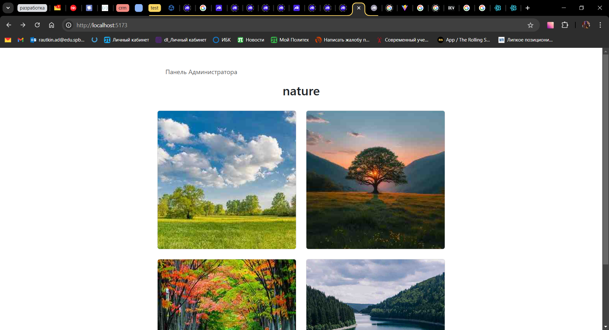
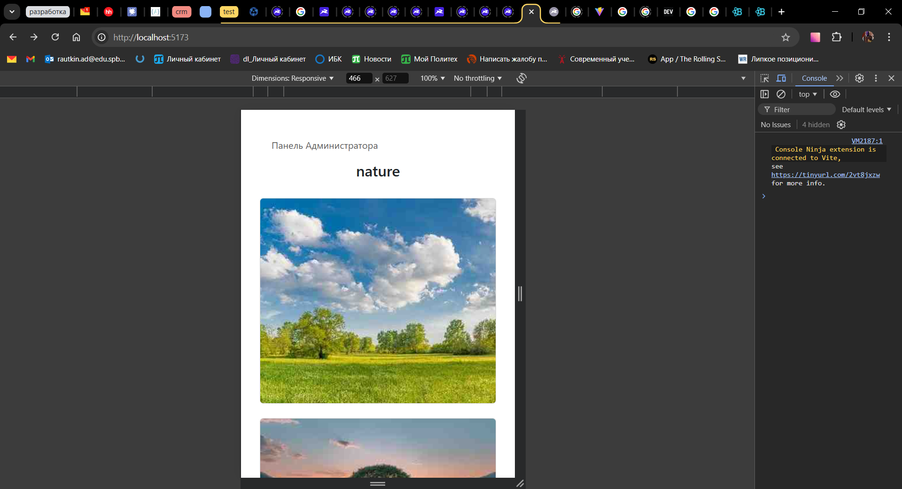
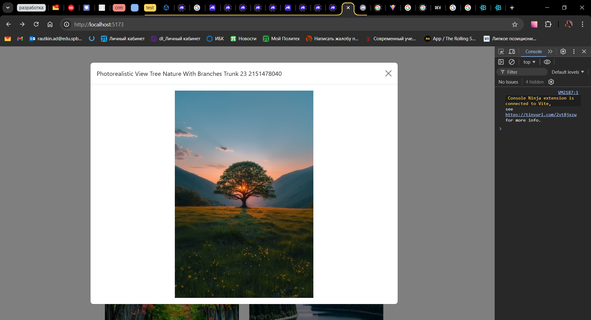
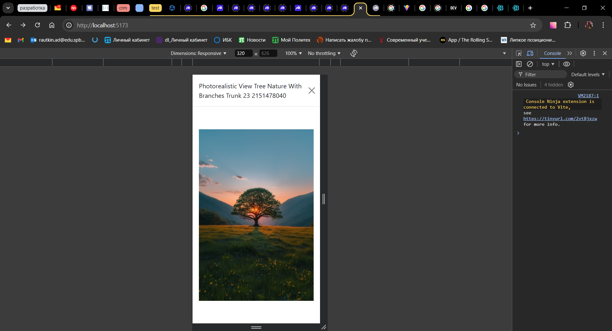

# Приложение "Галерея"

## Сборка

Для работы приложения на компьютер должен быть установлен **Docker** и **node.js**

1. Клонируем репозиторий
`git clone https://github.com/Slumrag/greenatom-test2024.git`

1. Устанавливаем JavaScript зависимости
`npm i`

1. Запускаем Docker
1. Разворачиваем контейнер с бекэндом
`docker compose up`

1. Запускаем сервер vite
`npm run dev`

## функционал

В приложении реализовал:

- Адаптивную мобильную вёрстку
- открытие модалки с увеличенным изображением при клики на карточку с изображением

Альбомы на бекэнде реализованы в виде папок внутри папки *albums*. Внутри каждой папки находятся изображения альбома. Вложенные в альбом папки и файлы игнорируются.

PS Для построения интерфейса использовал react-bootstrap. Для работы с api directus использовал directus SDK.

## Скриншоты

**Данные для доступа в directus**

admin

<admin@example.com>

d1r3ctu5
